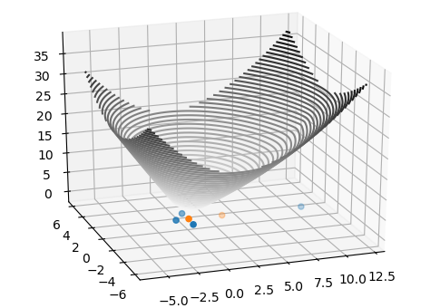

# Geometric median, neat Python implementation of Weiszfeld's algorithm 

## Definition of Geometric median

* Geometric median, 
* L1 median, L1-estimator
* spatial median
* Multi-facility allocation problem
* Euclidean minisum

Many ways to denote same definition : "the point minimizing the sum of distances to the sample points" : https://en.wikipedia.org/wiki/Geometric_median

There is no direct expression, even today. As a sum of convex functions we know that the expression does have an absolute minimum. Let's approximate it. 

## Weiszfeld's algorithm
Weiszfeld published in 1937 an algorithm to approximate the geometric median.
A standard gradient descent approach. It is still frequently used due to its rapid convergence.

For each iteration the algorithm defines a set of weights that are the inverse of the distances from current estimate to sample points.
Next estimate is the weighted geometric mean :

You will find many implementations out there, in many languages. It can be expressed in a straightforward way using Python matrix support. 

## Python implementation

Let's denote X the matrix holding the sample points. And y an estimate.

Using Euclidean support of SciPy we can compute the matrix of inverse of distances :

    W = 1/cdist(X,[y])

With Python NumPy multi-dimensional array support the expression of estimate is :

    np.sum(W*X,0)/np.sum(W)

sum(.,0) denotes that the sum is constraint to axis 0 : matrix sum operating only at point level.

We can iterator over until the distance between 2 consecutive estimates is less that a given error margin. 

## Illustration geometric median vs geometric mean

In blue the sample points. In orange the median. In red the geometric median.

Do notice how the L1-estimator is more robust to outliers...

## Weighted geometric median
You may be faced to a multi-facility location challenge where all the facilities do not have same importance.
To address that situation you can attach weights to the sample points.

The weighted geometric median is defined as :

So we have functional weights corresponding to the importance of each sample point, let's denote WX that the collection of weights.
In addition we have spatial weights relatively to the iteration itself : the inverse distances.

The combined weights can now be computed element-wise like so :

    W = WX/cdist(X,[y])

With that in mind the iteration estimate has same expression :

    np.sum(W*X,0)/np.sum(W)
